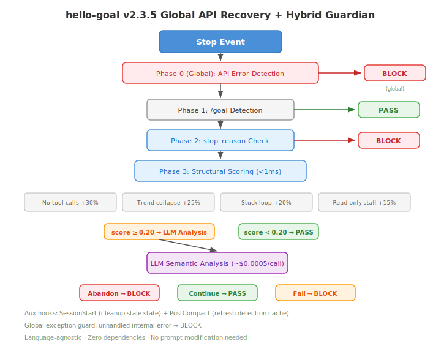

<div align="center">
  
</div>

# goal-hook

当 Claude Code 内置 Stop hook 因 JSON 校验失败中断 `/goal` 会话时，由 goal-hook 接管。基于文件状态、零依赖、崩溃安全。

[](./RELEASE_NOTES.md)
[](./LICENSE)
[](https://linux.do)

[English](./README.md) · [简体中文](./README_CN.md)

> 本项目已获得 [LINUX DO](https://linux.do) 社区认可。

## 目录

<details>
<summary><strong>点击展开</strong></summary>

- [概览](#概览)
- [工作原理](#工作原理)
- [快速开始](#快速开始)
- [使用方式](#使用方式)
- [推荐设置](#推荐设置)
- [文件说明](#文件说明)
- [版本历史](#版本历史)
- [FAQ](#faq)
- [许可证](#许可证)

</details>

## 概览

Claude Code 的 `/goal` 内置了一个 prompt-type Stop hook，用小模型评估任务进度。该模型可能输出格式错误的 JSON，导致 **"Stop hook error: JSON validation failed"**，在任务中途杀死会话。

**goal-hook** 以 command-type hook 并行运行。当内置 hook 失败时，本插件根据磁盘文件状态独立判断，确保任务不被中断。

### 解决了什么问题

| 场景 | 无 goal-hook | 有 goal-hook |
|------|-------------|-------------|
| 内置 hook 输出非法 JSON | 会话终止 | 文件状态拦截，任务继续 |
| 上下文压缩导致状态丢失 | 状态消失 | 磁盘文件不受影响 |
| 会话崩溃残留状态 | 永久阻塞 | 7 天后自动过期 |

## 工作原理

插件注册一个 command-type Stop hook，读取单个状态文件（`scripts/data/.goal_status.json`）：

<div align="center">
  
</div>

**三种状态：**

| 文件状态 | Hook 行为 | 时机 |
|---------|----------|------|
| 文件不存在 | **放行**（无干预） | 非 `/goal` 会话 |
| `status: "in_progress"` | **阻止**（继续循环） | 目标循环进行中 |
| `status: "terminated"` | **放行 + 清理** | 目标已达成 |

### 崩溃恢复

`/goal` 会话在写入 `terminated` 前崩溃时，残留的 `in_progress` 文件会在 **未更新超过 168 小时（7 天）** 后自动过期。活跃的 GOAL_PROMPT 每轮重写文件，不会触发超时。

### 设计原则

- **零依赖**——不读 transcript，不探测环境变量，不依赖 CC 内部机制
- **文件持久化**——状态不受上下文压缩影响
- **非侵入**——无文件即无干预，非 `/goal` 会话完全不受影响

## 快速开始

### 前置条件

- 已安装 [Claude Code](https://claude.ai/code)
- Python 3

### 安装

```bash
git clone https://github.com/hellowind777/goal-hook.git
cd goal-hook
python setup.py
```

重启 Claude Code。完成。

### 手动安装

克隆仓库后，在 `~/.claude/settings.json` 中添加：

```json
{
  "enabledPlugins": {
    "goal-hook@goal-hook-marketplace": true
  },
  "extraKnownMarketplaces": {
    "goal-hook-marketplace": {
      "source": {
        "path": "/path/to/goal-hook",
        "source": "directory"
      }
    }
  }
}
```

### 验证

`setup.py` 会自动验证所有文件就位：

```
[1/3] 安装到 ~/.claude/plugins/local-marketplaces/goal-hook-marketplace/plugins/goal-hook ...
[2/3] 注册到 settings.json ...
[3/3] 验证 ...
  [OK] hooks/hooks.json
  [OK] scripts/_goal_check.py
  [OK] .claude-plugin/plugin.json

已安装: .../goal-hook-marketplace
重启 Claude Code 激活。
```

## 使用方式

hook 本身无需用户操作。由你的 GOAL_PROMPT 写入状态文件。

**启动时：**

```python
import json
json.dump({"status": "in_progress", "reason": "任务进行中"},
          open("scripts/data/.goal_status.json", "w", encoding="utf-8"))
```

**完成时：**

```python
import json
json.dump({"status": "terminated", "reason": "所有检查通过"},
          open("scripts/data/.goal_status.json", "w", encoding="utf-8"))
```

hook 阻止停止时，Agent 会看到自动终止指令：

```
[goal-hook] GOAL_PROMPT 循环执行中。
当你确认目标已达成，执行:
python -c "import json; json.dump({'status':'terminated','reason':'目标达成'},
open('scripts/data/.goal_status.json','w',encoding='utf-8'))"
```

## 推荐设置

```json
"CLAUDE_CODE_STOP_HOOK_BLOCK_CAP": "1000"
```

Claude Code v2.1.143+ 强制限制 Stop hook 最多连续阻止 8 次。提高此值可防止正常的长任务被误杀。

## 文件说明

| 文件 | 用途 |
|------|------|
| `plugins/goal-hook/hooks/hooks.json` | Stop hook 注册 |
| `plugins/goal-hook/scripts/_goal_check.py` | 状态文件检测器（99 行） |
| `plugins/goal-hook/.claude-plugin/plugin.json` | 插件元数据 |
| `.claude-plugin/marketplace.json` | 市场清单 |
| `setup.py` | 一键跨平台安装脚本 |

## 版本历史

### v1.0.8 (2026-06-20)

- 全面重写 README（中英双版本、hero banner、LINUX DO 认可）
- LICENSE 更新为双许可证（Apache 2.0 + CC BY 4.0）

### v1.0.7 (2026-06-20)

- 标准化 CC marketplace 目录结构（`plugins/goal-hook/`）
- 移除旧的 `setup.bat` 和 `setup.ps1`

### v1.0.6

- 修复 Stop hook 输出为合法 JSON schema（放行 `{}`，阻止 `{"decision":"block",...}`）
- 插件安装到 CC 插件目录而非直指仓库
- setup.py 处理 Windows junction 删除

[完整发布说明](./RELEASE_NOTES.md)

## FAQ

<details>
<summary><strong>Q: 会影响非 /goal 会话吗？</strong></summary>

**A:** 不会。`.goal_status.json` 不存在时，hook 直接放行。零开销，零干扰。
</details>

<details>
<summary><strong>Q: /goal 会话中途崩溃了怎么办？</strong></summary>

**A:** 残留的 `in_progress` 文件在超过 168 小时（7 天）后自动过期。活跃任务每轮都会重写文件，不会触发此限制。
</details>

<details>
<summary><strong>Q: 可以和任意 GOAL_PROMPT 搭配使用吗？</strong></summary>

**A:** 可以。hook 完全不关心 GOAL_PROMPT 的内容，只读取状态文件。任何会写入 `in_progress` / `terminated` 到指定路径的 prompt 都能使用。
</details>

<details>
<summary><strong>Q: 内置 hook 和 goal-hook 同时运行会冲突吗？</strong></summary>

**A:** 不会。Claude Code 会执行所有已注册的 Stop hook。Command-type hook（goal-hook）独立运行。即使内置 prompt hook 因 JSON 错误失败，command hook 仍会检查文件并阻止停止。
</details>

## 许可证

本项目采用 [Apache-2.0 许可证](./LICENSE)。

---

<div align="center">


</div>
